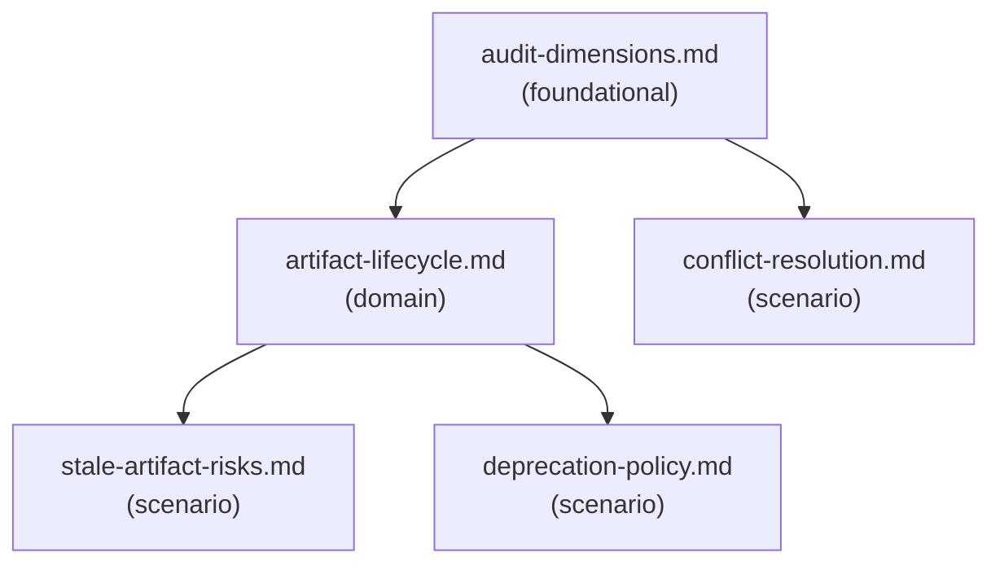

# Reference Index: ai-artifact-auditor

This index maps all reference files for this skill, their tiers, purposes, and
relationships. Use it to navigate the reference graph and determine load order
without loading all files.

## Reference Graph

## Reference Table

| File | Tier | Purpose | Load when | See also |
|------|------|---------|-----------|----------|
| `audit-dimensions.md` | foundational | 9 audit dimensions for evaluating any AI artifact | Starting any audit — load this first | artifact-lifecycle.md |
| `artifact-lifecycle.md` | domain | 7-stage artifact lifecycle; criteria for split, merge, deprecate, and retire | Assessing artifact health or deciding a lifecycle action | audit-dimensions.md, stale-artifact-risks.md, deprecation-policy.md |
| `stale-artifact-risks.md` | scenario | High-risk stale areas; staleness signals; mitigation strategies | Artifact shows staleness signs | artifact-lifecycle.md |
| `conflict-resolution.md` | scenario | Priority model for resolving conflicts; resolution patterns | Conflicts detected between artifacts | audit-dimensions.md |
| `deprecation-policy.md` | scenario | When to deprecate vs delete; deprecation note format; post-deprecation validation | Making a deprecation or deletion decision | artifact-lifecycle.md |

## Tier Convention

| Tier | Definition | Load rule |
|------|------------|-----------|
| **foundational** | No dependencies. Provides vocabulary and taxonomy. | Load first when classification or core vocabulary is needed. |
| **domain** | Extends a foundational reference for a specific lifecycle or workflow area. May reference foundational and other domain. | Load when the task targets that area. |
| **scenario** | Activated only when a specific condition is detected. May reference foundational and domain. | Load only when that condition is observed. |

## Navigation Rules

`see-also` is a forward navigation pointer ("after reading this file, also consider loading these"). It is not a dependency declaration.

- `foundational` has no upstream dependencies. Its `see-also` entries are forward hints pointing to `domain` files.
- `domain` has no upstream dependencies on `scenario`. Its `see-also` entries may point to `foundational` or other `domain` files.
- `scenario` has no upstream dependencies on other `scenario` files. Its `see-also` entries may point to `foundational` or `domain` files.
- Avoid bidirectional `see-also` between peer files at the same tier.
