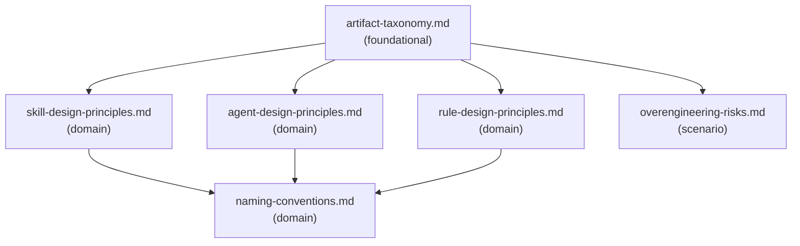

# Reference Index: ai-artifact-designer

This index maps all reference files for this skill, their tiers, purposes, and
relationships. Use it to navigate the reference graph and determine load order
without loading all files.

## Reference Graph

## Reference Table

| File | Tier | Purpose | Load when | See also |
|------|------|---------|-----------|----------|
| `artifact-taxonomy.md` | foundational | Classification of 6 AI artifact types with use cases, trade-offs, and risks | Classifying extension type or deciding which artifact type fits the workflow | skill-design-principles.md, agent-design-principles.md, rule-design-principles.md |
| `skill-design-principles.md` | domain | Criteria for creating vs avoiding Skills; SKILL.md structure guidance; reference tier convention | Designing or evaluating a Skill or its supporting files | artifact-taxonomy.md, naming-conventions.md |
| `agent-design-principles.md` | domain | Criteria for creating vs avoiding Agents; tool boundary defaults; escalation rules | Designing or evaluating an Agent or Subagent | artifact-taxonomy.md, naming-conventions.md |
| `rule-design-principles.md` | domain | Criteria for Good vs Poor rules; numbering convention; conflict avoidance | Designing or evaluating a rule in `rules/*.md` | artifact-taxonomy.md, naming-conventions.md |
| `overengineering-risks.md` | scenario | Warning signs; recommended progression; defer and avoid criteria | Deciding whether to create, defer, or avoid an artifact | artifact-taxonomy.md |
| `naming-conventions.md` | domain | Naming patterns for all artifact types; anti-patterns to avoid | Naming a new artifact or auditing naming consistency | — |

## Tier Convention

| Tier | Definition | Load rule |
|------|------------|-----------|
| **foundational** | No dependencies. Provides vocabulary and taxonomy. | Load first when classification or core vocabulary is needed. |
| **domain** | Extends a foundational reference for a specific artifact type. May reference foundational and other domain. | Load when the task targets that artifact type. |
| **scenario** | Activated only when a specific condition is detected. May reference foundational and domain. | Load only when that condition is observed. |

## Navigation Rules

`see-also` is a forward navigation pointer ("after reading this file, also consider loading these"). It is not a dependency declaration.

- `foundational` has no upstream dependencies. Its `see-also` entries are forward hints pointing to `domain` files.
- `domain` has no upstream dependencies on `scenario`. Its `see-also` entries may point to `foundational` or other `domain` files.
- `scenario` has no upstream dependencies on other `scenario` files. Its `see-also` entries may point to `foundational` or `domain` files.
- Avoid bidirectional `see-also` between peer files at the same tier.
