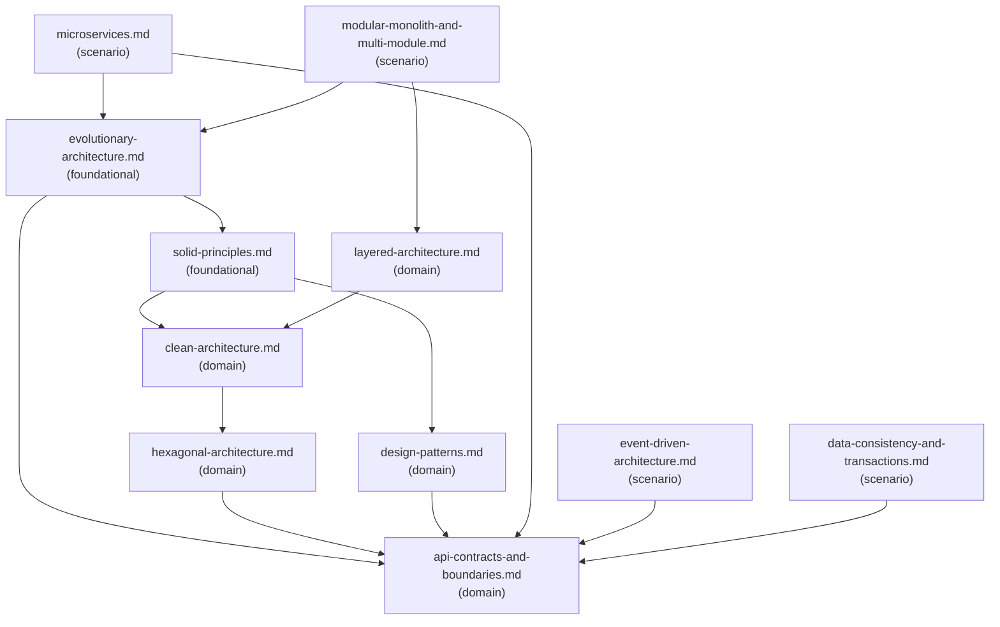

# Reference Index: architecture-and-design-review

Maps all reference files, tiers, purposes, and relationships.
Use this index to determine which files to load without reading all of them.

## Reference Graph

## Reference Table

| File | Tier | Purpose | Load when | See also |
|------|------|---------|-----------|----------|
| `evolutionary-architecture.md` | foundational | Meta-principle for safe architecture evolution; when to commit, defer, or reverse decisions | Evaluating architectural commitment or decision reversibility | solid-principles.md, api-contracts-and-boundaries.md |
| `solid-principles.md` | foundational | SOLID heuristics for module and class responsibility, coupling, and abstraction quality | Reviewing class or module design for cohesion, coupling, or abstraction | design-patterns.md, clean-architecture.md |
| `clean-architecture.md` | domain | Dependency inversion and layer isolation from frameworks, databases, and UI | Design separates business logic from infrastructure; dependency direction is a concern | hexagonal-architecture.md |
| `layered-architecture.md` | domain | Layer structure with responsibility rules and common risks | Application uses conventional layers; reviewing layer responsibility or dependency direction | clean-architecture.md |
| `hexagonal-architecture.md` | domain | Ports and adapters pattern; isolating application core from external actors | Design uses or should use ports/adapters; reviewing adapter isolation or port naming | api-contracts-and-boundaries.md |
| `design-patterns.md` | domain | Common structural and behavioral patterns with applicability criteria | Evaluating whether a pattern solves a recurring structural or behavioral force | api-contracts-and-boundaries.md |
| `api-contracts-and-boundaries.md` | domain | Contract review dimensions — compatibility, error model, versioning, DTO boundaries | Reviewing any API, event schema, module interface, or service contract | — |
| `microservices.md` | scenario | When to use microservices; prerequisites and common decomposition risks | Evaluating service decomposition or cross-service communication design | evolutionary-architecture.md, api-contracts-and-boundaries.md |
| `modular-monolith-and-multi-module.md` | scenario | Modular monolith boundaries and multi-module Java conventions | Reviewing internal module structure or evaluating service extraction readiness | layered-architecture.md, evolutionary-architecture.md |
| `event-driven-architecture.md` | scenario | Event design principles and common EDA patterns | Design involves async messaging, event publishing/consuming, or EDA workflows | api-contracts-and-boundaries.md |
| `data-consistency-and-transactions.md` | scenario | Transaction boundaries, consistency models, risks, and coordination patterns | Reviewing transaction scope, distributed consistency, outbox, saga, or idempotency | api-contracts-and-boundaries.md |

## Tier Convention

| Tier | Definition | Load rule |
|------|------------|-----------|
| **foundational** | No dependencies. Provides vocabulary and core principles. | Load first when general design heuristics or architectural philosophy is needed. |
| **domain** | Extends foundational for a specific architecture style or concern. | Load when the task targets that architecture style or boundary type. |
| **scenario** | Activated only when a specific design condition is detected. | Load only when that condition is observed in the task. |

## Navigation Rules

`see-also` is a forward navigation pointer ("after reading this file, also consider loading these based on the task"). It is not a dependency declaration.

- `foundational` has no upstream dependencies. Its `see-also` entries are forward hints to `domain` files.
- `domain` has no upstream dependencies on `scenario`. Its `see-also` entries may point to `foundational` or other `domain` files.
- `scenario` has no upstream dependencies on other `scenario` files. Its `see-also` entries may point to `foundational` or `domain` files.
- Avoid bidirectional `see-also` between peer files at the same tier.
