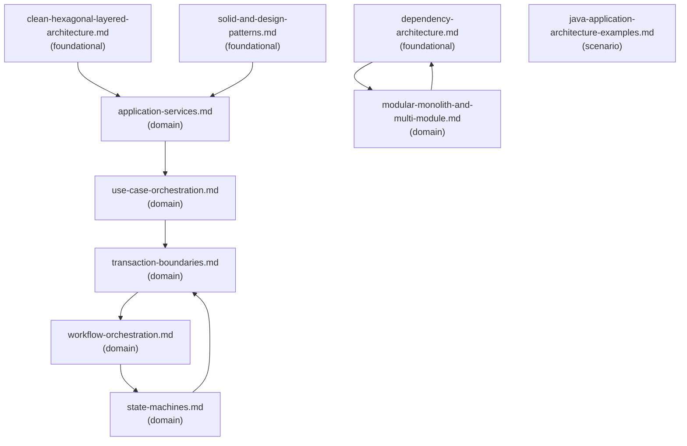

# Reference Index: backend-application-architecture

This index maps all reference files, their tiers, purposes, and relationships.
Use it to navigate the graph and determine which files to load without reading all of them.

## Reference Graph

## Reference Table

| File | Tier | Purpose | Load when | See also |
| ---- | ---- | ------- | --------- | -------- |
| `clean-hexagonal-layered-architecture.md` | foundational | Architecture style vocabulary and trade-offs | Architecture style selection or layer responsibility review | `dependency-architecture.md` |
| `dependency-architecture.md` | foundational | Dependency direction, inversion, injection, composition root, cycles | Dependency direction or coupling review | `modular-monolith-and-multi-module.md` |
| `solid-and-design-patterns.md` | foundational | SOLID principles and backend design pattern vocabulary | Code structure, responsibility, or pattern selection | `application-services.md` |
| `application-services.md` | domain | Application service responsibilities and god service anti-patterns | Designing or reviewing application service boundaries | `use-case-orchestration.md` |
| `use-case-orchestration.md` | domain | Orchestration responsibilities and workflow smells for a single use case | Designing or reviewing use-case orchestration logic | `transaction-boundaries.md` |
| `transaction-boundaries.md` | domain | Atomicity, side effect ordering, retry, and post-commit recovery | Transaction boundaries or post-commit side effects | `workflow-orchestration.md` |
| `modular-monolith-and-multi-module.md` | domain | Module ownership, public API design, and cycle prevention | Module boundaries, ownership, or dependency cycles | `dependency-architecture.md` |
| `workflow-orchestration.md` | domain | Multi-step durable workflow design — retry, compensation, stuck-state | Multi-step async, event-driven, job, or saga-like workflow design | `state-machines.md` |
| `state-machines.md` | domain | State machine design — transitions, guards, side effects, persistence | Entity with meaningful lifecycle and transition rules | `transaction-boundaries.md` |
| `java-application-architecture-examples.md` | scenario | Java code sketches — use case, port, state rule — illustrative only | Java code examples explicitly requested | (none) |

## Tier Convention

| Tier | Definition | Load rule |
| ---- | ---------- | --------- |
| **foundational** | Core vocabulary and principles. No upstream dependencies. | Load first when general classification or vocabulary is needed. |
| **domain** | Specific workflow or architecture area. May reference foundational via `see-also`. | Load when the task targets that specific area. |
| **scenario** | Load only when a specific condition is detected. | Load only when that condition is observed. |

## Navigation Rules

`see-also` is a forward navigation pointer — "after reading this file, also consider loading these."
It is not a dependency declaration.

- `foundational` → no upstream dependencies; `see-also` points forward to `domain` files.
- `domain` → no upstream dependencies on `scenario`; `see-also` may point to `foundational` or other `domain`.
- `scenario` → no upstream dependencies; `see-also: []` for terminal leaves.
- Avoid bidirectional `see-also` between peer files at the same tier.
