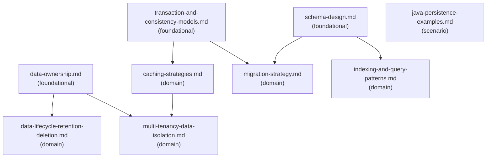

# Reference Index: backend-data-and-persistence

This index maps all reference files, their tiers, purposes, and relationships.
Use it to navigate the graph and determine which files to load without reading all of them.

## Reference Graph

## Reference Table

| File | Tier | Purpose | Load when | See also |
| ---- | ---- | ------- | --------- | -------- |
| `data-ownership.md` | foundational | Ownership vocabulary — who can write, read, and share data; source of truth; cross-service access | Identifying data owner, shared access contract, or writer/reader boundaries | `multi-tenancy-data-isolation.md`, `data-lifecycle-retention-deletion.md` |
| `schema-design.md` | foundational | Relational and NoSQL schema vocabulary — constraints, normalization, aggregate shape, partition keys, evolution | Designing or reviewing a storage structure, entity model, or data model | `indexing-and-query-patterns.md`, `migration-strategy.md` |
| `transaction-and-consistency-models.md` | foundational | Consistency models, transaction smell detection, outbox pattern, idempotency keys, saga | Reviewing transaction boundaries, consistency requirements, or distributed write coordination | `migration-strategy.md`, `caching-strategies.md` |
| `caching-strategies.md` | domain | Caching patterns, invalidation strategies, TTL, stampede protection, distributed vs local | Designing or reviewing cache behavior, invalidation logic, or cache correctness | `multi-tenancy-data-isolation.md` |
| `indexing-and-query-patterns.md` | domain | Query review checklist, index design questions, performance smells — missing tenant filter, N+1, deep pagination | Reviewing or designing queries, indexes, or query performance | — |
| `migration-strategy.md` | domain | Expand-contract migration pattern, high-risk change classification, backfill safety, production validation | Planning or reviewing a schema migration, backfill, or destructive change | — |
| `multi-tenancy-data-isolation.md` | domain | Tenant isolation models, missing predicate failure modes, background job tenant awareness | Reviewing multi-tenant data access, tenant-scoped queries, or isolation design | — |
| `data-lifecycle-retention-deletion.md` | domain | Data lifecycle from creation to deletion — retention policy, privacy questions, soft delete risks | Reviewing retention policy, deletion behavior, privacy compliance, or data lifecycle | — |
| `java-persistence-examples.md` | scenario | Java code snippets: repository port, tenant-safe query shape, idempotency constraint | Java persistence code examples explicitly requested | — |

## Tier Convention

| Tier | Definition | Load rule |
| ---- | ---------- | --------- |
| **foundational** | Core vocabulary and principles. No upstream dependencies. | Load first when general classification or vocabulary is needed. |
| **domain** | Specific workflow area. May reference foundational via `see-also`. | Load when the task targets that specific area. |
| **scenario** | Load only when a specific condition is detected. | Load only when that condition is observed. |

## Navigation Rules

`see-also` is a forward navigation pointer — "after reading this file, also consider loading these."
It is not a dependency declaration.

- `foundational` → no upstream dependencies; `see-also` points forward to `domain` files.
- `domain` → no upstream dependencies on `scenario`; `see-also` may point to `foundational` or other `domain`.
- `scenario` → no upstream dependencies; `see-also: []` for terminal leaves.
- Avoid bidirectional `see-also` between peer files at the same tier.
