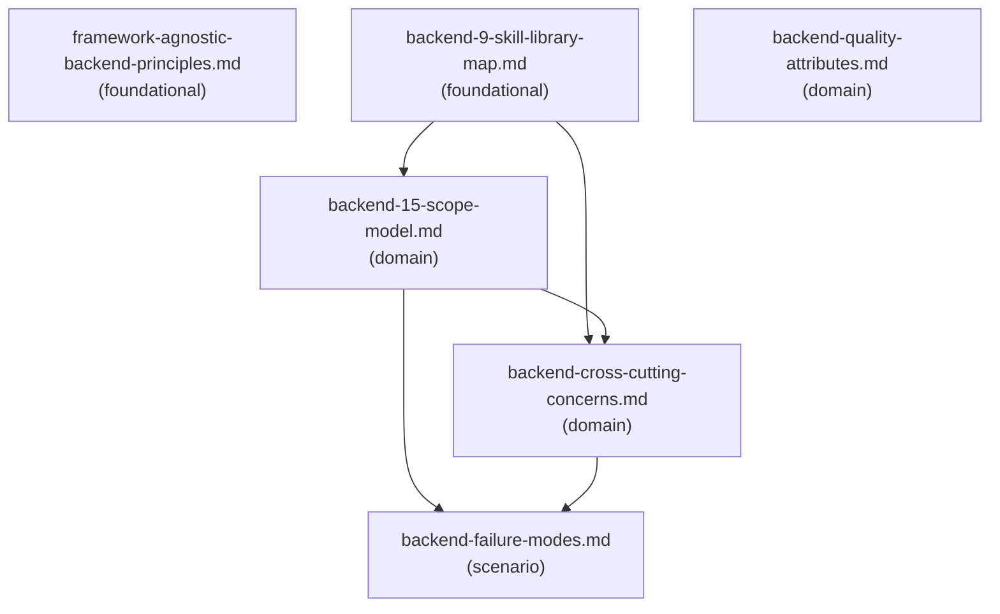

# Reference Index: backend-development-core

This index maps all reference files for this skill, their tiers, purposes, and
relationships. Use it to navigate the reference graph and determine load order
without loading all files.

## Reference Graph

## Reference Table

| File | Tier | Purpose | Load when | See also |
|------|------|---------|-----------|----------|
| `framework-agnostic-backend-principles.md` | foundational | 12 framework-agnostic backend principles for analyzing systems without assuming a specific framework, vendor, or cloud | Starting any broad backend task where framework and platform assumptions must be avoided | — |
| `backend-9-skill-library-map.md` | foundational | Maps broad backend requests to the 9 specialized backend Skills with use cases, inputs, and expected outputs per scope | Routing a backend task to a specialized Skill — load before or during scope selection | backend-15-scope-model.md, backend-cross-cutting-concerns.md |
| `backend-quality-attributes.md` | domain | 17 quality attributes for evaluating backend designs beyond correctness; includes trade-off table and validation evidence examples | Evaluating a backend design, identifying trade-offs, or defining the quality bar for a task | — |
| `backend-cross-cutting-concerns.md` | domain | 9 cross-cutting backend concerns that apply across all scopes | Task triage reveals multiple overlapping scopes or cross-cutting risk signals | backend-failure-modes.md |
| `backend-15-scope-model.md` | domain | Full 15-scope technology-neutral backend taxonomy with definitions, key concerns, typical questions, and AI guidance | 9-scope routing is insufficient or deeper analysis of a specific scope is needed | backend-failure-modes.md, backend-cross-cutting-concerns.md |
| `backend-failure-modes.md` | scenario | Categorized backend failure modes across all 9 scopes for risk triage | Identifying specific failure risks for a selected backend scope during task triage | — |

## Tier Convention

| Tier | Definition | Load rule |
|------|------------|-----------|
| **foundational** | No dependencies. Provides vocabulary and routing map. | Load first when classification or routing is needed. |
| **domain** | Extends a foundational reference for a specific backend area. May reference foundational. | Load when the task targets that area. |
| **scenario** | Activated only when a specific condition is detected. May reference foundational and domain. | Load only when that condition is observed. |

## Navigation Rules

`see-also` is a forward navigation pointer ("after reading this file, also consider loading these"). It is not a dependency declaration.

- `foundational` has no upstream dependencies. Its `see-also` entries are forward hints pointing to `domain` files.
- `domain` has no upstream dependencies on `scenario`. Its `see-also` entries may point to `foundational` or other `domain` files.
- `scenario` has no upstream dependencies on other `scenario` files. Its `see-also` entries may point to `foundational` or `domain` files.
- Avoid bidirectional `see-also` between peer files at the same tier.
