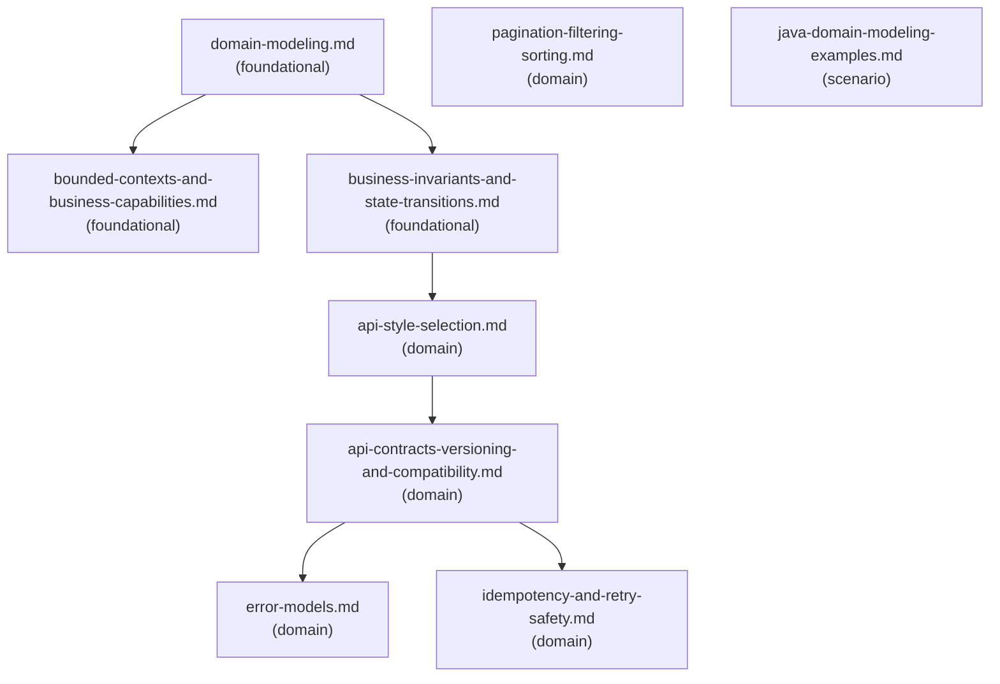

# Reference Index: backend-domain-and-api-design

This index maps all reference files, their tiers, purposes, and relationships.
Use it to navigate the graph and determine which files to load without reading all of them.

## Reference Graph

## Reference Table

| File | Tier | Purpose | Load when | See also |
| ---- | ---- | ------- | --------- | -------- |
| `domain-modeling.md` | foundational | Core domain vocabulary: entity, value object, aggregate, domain event, invariant, command, query | Domain modeling or core domain concepts needed | `bounded-contexts-and-business-capabilities.md`, `business-invariants-and-state-transitions.md` |
| `bounded-contexts-and-business-capabilities.md` | foundational | Bounded context, capability ownership, shared language, model boundary failure modes | Bounded context design or capability ownership review | (none) |
| `business-invariants-and-state-transitions.md` | foundational | Invariants, state transition model, guard conditions, correctness smells | Business invariants, state transitions, or correctness review | `api-style-selection.md` |
| `api-style-selection.md` | domain | Interface style trade-offs: REST-like, RPC, GraphQL, event, command, webhook, internal | Comparing or selecting an API/interface style | `api-contracts-versioning-and-compatibility.md` |
| `api-contracts-versioning-and-compatibility.md` | domain | Contract elements, backward-compatible vs breaking changes, validation strategy | API contract review, versioning, or compatibility analysis | `error-models.md`, `idempotency-and-retry-safety.md` |
| `error-models.md` | domain | Error dimensions, design principles, common categories, review smells | Error model design or review | (none) |
| `idempotency-and-retry-safety.md` | domain | When to apply idempotency, key design, storage patterns, failure modes | Idempotency, retry safety, or at-least-once delivery | (none) |
| `pagination-filtering-sorting.md` | domain | Pagination styles, filter/sort constraints, review smells for list APIs | List API pagination, filtering, or sorting design | (none) |
| `java-domain-modeling-examples.md` | scenario | Java code sketches: value object, state machine enum, domain entity — illustrative only | Java code examples explicitly requested | (none) |

## Tier Convention

| Tier | Definition | Load rule |
| ---- | ---------- | --------- |
| **foundational** | Core vocabulary and principles. No upstream dependencies. | Load first when domain classification or vocabulary is needed. |
| **domain** | Specific workflow area. May reference foundational via `see-also`. | Load only when the task targets that specific area. |
| **scenario** | Condition-specific. No upstream dependencies on other scenario files. | Load only when the specific condition is observed. |

## Navigation Rules

`see-also` is a forward navigation pointer — "after reading this file, also consider loading these."
It is not a dependency declaration.

- `foundational` → no upstream dependencies; `see-also` points forward to `foundational` or `domain`.
- `domain` → no upstream dependencies on `scenario`; `see-also` may point to `foundational` or other `domain`.
- `scenario` → no upstream dependencies; `see-also: []` for terminal leaves.
- Avoid bidirectional `see-also` between peer files at the same tier.
