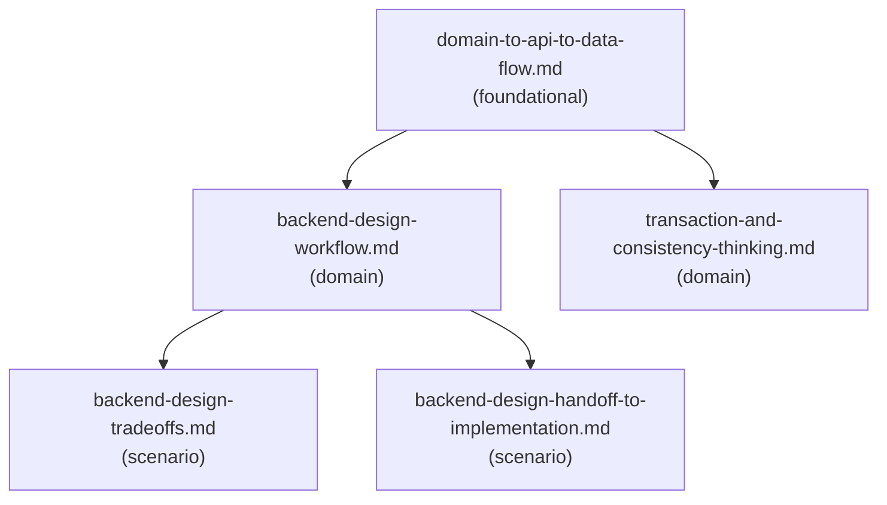

# Reference Index: backend-feature-design

This index maps all reference files for this skill, their tiers, purposes, and
relationships. Use it to navigate the reference graph and determine load order
without loading all files.

## Reference Graph

## Reference Table

| File | Tier | Purpose | Load when | See also |
|------|------|---------|-----------|----------|
| `domain-to-api-to-data-flow.md` | foundational | Core reasoning sequence: business capability → domain concepts → API contract → data ownership | Early design phase — translating feature intent into domain or API structure | backend-design-workflow.md, transaction-and-consistency-thinking.md |
| `backend-design-workflow.md` | domain | 10-step procedural workflow with quality bar and readiness criteria | Executing a full backend feature design | backend-design-tradeoffs.md, backend-design-handoff-to-implementation.md |
| `transaction-and-consistency-thinking.md` | domain | Transaction boundary rules, consistency patterns (outbox, saga, idempotency), and failure matrix | Feature involves writes, side effects, or cross-service calls | — |
| `backend-design-tradeoffs.md` | scenario | Common trade-offs table and decision record pattern | Choosing between competing design options | — |
| `backend-design-handoff-to-implementation.md` | scenario | Handoff checklist and prompt template for backend-feature-implementation | Design is complete and ready to hand off | — |

## Tier Convention

| Tier | Definition | Load rule |
|------|------------|-----------|
| **foundational** | No dependencies. Provides vocabulary and core reasoning sequence. | Load first when beginning a design — provides the thinking framework. |
| **domain** | Extends foundational for a specific workflow area. | Load when the task targets that concern (full workflow, data/transactions). |
| **scenario** | Activated only when a specific condition is detected. | Load only when that condition is observed (option analysis, handoff). |

## Navigation Rules

`see-also` is a forward navigation pointer ("after reading this file, also consider loading these"). It is not a dependency declaration.

- `foundational` has no upstream dependencies. Its `see-also` entries point forward to `domain` files.
- `domain` has no upstream dependencies on `scenario`. Its `see-also` entries may point forward to `scenario` files.
- `scenario` files are terminal leaves — `see-also: []`.
- Avoid bidirectional `see-also` between peer files at the same tier.
