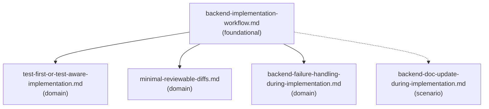

# Reference Index: backend-feature-implementation

Maps all supporting files, their tiers, purposes, and relationships. Use this index to navigate the reference graph and determine load order without loading all files.

## Reference Graph

Solid arrows = load-order guidance. Load the source before the target when that area is relevant.

Dashed arrow = conditional scenario. Load only when the specific condition is detected.

## Reference Table

| File | Tier | Purpose | Load when | See also |
| --- | --- | --- | --- | --- |
| `backend-implementation-workflow.md` | foundational | Phase-by-phase workflow with entry/exit criteria, decision heuristics, and common pitfalls per phase | Starting any backend implementation task; reviewing phase transition decisions | `test-first-or-test-aware-implementation.md`, `minimal-reviewable-diffs.md`, `backend-failure-handling-during-implementation.md` |
| `test-first-or-test-aware-implementation.md` | domain | Decision rules for test-first vs implement-then-test; test type selection matrix by change type; test quality criteria | Deciding when to write tests before vs after implementation; selecting the right test type | `backend-implementation-workflow.md` |
| `minimal-reviewable-diffs.md` | domain | Principles and rules for keeping backend changes small, focused, and independently reviewable | Planning or reviewing edit scope; deciding whether to split a change; noticing the planned change is growing large | `backend-implementation-workflow.md` |
| `backend-failure-handling-during-implementation.md` | domain | Failure type classification and structured failure report pattern for implementation-time failures | A check, build, or test has failed during implementation and a root cause analysis or escalation decision is needed | `backend-implementation-workflow.md` |
| `backend-doc-update-during-implementation.md` | scenario | Decision criteria for when to update docs during implementation; docs to consider; what to avoid | Implementation changes a public API contract, error model, config requirements, operational behavior, or developer workflow | — |

## Tier Convention

| Tier | Definition | Load rule |
| --- | --- | --- |
| **foundational** | No upstream dependencies. Provides workflow vocabulary and core phase structure. | Load first when starting a backend implementation task or when classification is needed. |
| **domain** | Extends the foundational workflow for a specific implementation practice area. May reference foundational via `see-also`. | Load when the task targets that practice area. |
| **scenario** | Activated only when a specific condition is detected. May reference foundational and domain via `see-also`. | Load only when that condition is observed. |

## Checklist Navigation

| File | Purpose | Load when |
| --- | --- | --- |
| `checklists/before-backend-edit-checklist.md` | Pre-edit gate: confirms understanding, conventions, risks, and plan completeness | Before making any backend edit |
| `checklists/backend-risk-gate-checklist.md` | Approval gate: flags changes requiring explicit user confirmation before proceeding | During planning, when any risky area may be touched |
| `checklists/backend-implementation-done-checklist.md` | Post-implementation completeness check | Before producing the final implementation summary |

## Template Navigation

| File | Purpose | Load when |
| --- | --- | --- |
| `templates/backend-implementation-plan.md` | Implementation plan with exploration summary, affected files, strategy, test plan, validation, and exit criteria | Producing a structured implementation plan |
| `templates/backend-task-breakdown.md` | Task breakdown with work items, ordering, parallelism, and rollback notes | Splitting a large implementation into parallel or sequential tasks |
| `templates/backend-implementation-summary.md` | Post-implementation summary with files changed, behavior, tests, validation, failures, risks, and follow-ups | Producing the final implementation summary |
| `templates/backend-validation-report.md` | Detailed validation report with commands run, test results, failures, manual review items, and confidence | Producing a standalone validation report for a backend change |
| `templates/backend-exit-criteria.md` | Readiness checklist across functional, code, risk, validation, and summary criteria | Evaluating whether implementation is ready to summarize |

## Example Navigation

| File | Purpose | Load when |
| --- | --- | --- |
| `examples/java-backend-implementation-plan-example.md` | Filled-in implementation plan example for a Java backend feature | Calibrating plan depth, table format, or risk identification |

## Navigation Rules

- Load `reference-index.md` first when the implementation task is broad or multiple references may apply.
- Load `backend-implementation-workflow.md` for any non-trivial backend implementation task.
- Load domain references only when the specific practice area is relevant to the current task:
  - `test-first-or-test-aware-implementation.md` for test sequencing and test type decisions.
  - `minimal-reviewable-diffs.md` for diff scope decisions or when the planned change is growing.
  - `backend-failure-handling-during-implementation.md` when a check, build, or test has failed.
- Load `backend-doc-update-during-implementation.md` only when a public contract, operational behavior, or developer workflow is changing.
- Load checklists at the specific phase gate they are designed for — do not pre-load all checklists.
- Load templates only when producing the corresponding output artifact.
- Load the example only for calibrating output format or depth.

`see-also` is a forward navigation pointer ("after reading this file, also consider loading these"). It is not a dependency declaration.

- `foundational` has no upstream dependencies. Its `see-also` entries are forward hints pointing to `domain` files.
- `domain` has no upstream dependencies on `scenario`. Its `see-also` entries may point to `foundational`.
- `scenario` has no upstream dependencies on other `scenario` files. Its `see-also` is empty (`[]`) for terminal leaves.
- Avoid bidirectional `see-also` between peer files at the same tier.
