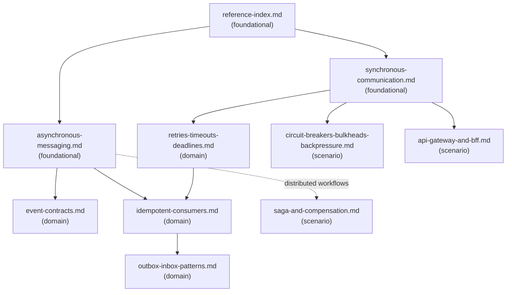

# Reference Index

## Dependency Graph

Solid arrows = primary load-order guidance. Load the source before the target when the task needs that detail. Dashed arrow = conditional: load only when workflow coordination or saga patterns are detected.

## Reference Table

| File | Tier | Purpose | Load when | See also |
| --- | --- | --- | --- | --- |
| `reference-index.md` | foundational | Navigation map for all supporting files in this Skill | Starting any integration analysis, or when unsure which reference to load | — |
| `synchronous-communication.md` | foundational | When to use sync communication, design questions, and failure modes for HTTP/RPC/internal API calls | Task involves HTTP APIs, RPC, internal service calls, SDK/client libraries, or external provider APIs | `retries-timeouts-deadlines.md`, `circuit-breakers-bulkheads-backpressure.md`, `api-gateway-and-bff.md` |
| `asynchronous-messaging.md` | foundational | When to use async messaging, common forms, design questions, and failure modes | Task involves message queues, pub/sub, event streams, webhooks, or scheduled jobs | `event-contracts.md`, `idempotent-consumers.md` |
| `retries-timeouts-deadlines.md` | domain | Rules and review questions for timeout/deadline config, retry classification, backoff, and retry-storm prevention | Defining or reviewing retry policy, timeout values, deadline propagation, or backoff strategy | `idempotent-consumers.md` |
| `event-contracts.md` | domain | Event design rules, backward/forward compatibility, schema registry guidance, and webhook contract safety | Designing or reviewing event schemas, event naming, schema versioning, or webhook payload contracts | — |
| `idempotent-consumers.md` | domain | Consumer idempotency rules, deduplication key design, failure modes for duplicate message delivery | Consumer may receive duplicate messages, or retry behavior may cause repeated side effects | `outbox-inbox-patterns.md` |
| `outbox-inbox-patterns.md` | domain | Outbox and inbox pattern design for reliable event publishing and message deduplication | State change must reliably publish an event/message, or consumer must deduplicate received messages | — |
| `circuit-breakers-bulkheads-backpressure.md` | scenario | Circuit breaker, bulkhead, and backpressure patterns for reliability under dependency failure or overload | Dependency failures are frequent, resource pools are shared, consumer lag is detected, or rate limiting is needed | — |
| `saga-and-compensation.md` | scenario | Saga pattern for distributed workflow coordination without distributed transactions, compensation design | Workflow spans multiple services, atomic distributed transaction is unavailable, or compensation is required | — |
| `api-gateway-and-bff.md` | scenario | API gateway and BFF pattern scope, acceptable vs risky gateway responsibilities, and review questions | Integration involves an API gateway, BFF layer, or cross-cutting client-facing boundary | — |

## Checklist Navigation

| File | Purpose | Load when |
| --- | --- | --- |
| `checklists/integration-checklist.md` | Full integration design pass/fail checklist | Reviewing or designing any service integration |
| `checklists/event-driven-checklist.md` | Event-driven design pass/fail checklist | Task involves events, pub/sub, or async messaging |
| `checklists/idempotency-checklist.md` | Idempotency and deduplication pass/fail checklist | Operation may be retried or messages may be duplicated |
| `checklists/retry-timeout-checklist.md` | Retry and timeout policy pass/fail checklist | Defining or reviewing retry or timeout behavior |

## Template Navigation

| File | Purpose | Load when |
| --- | --- | --- |
| `templates/integration-design-review.md` | Full integration design review output template | Producing a complete integration design analysis |
| `templates/distributed-failure-mode-report.md` | Failure mode matrix and recovery strategy template | Analyzing distributed failure modes for a workflow |
| `templates/event-contract-review.md` | Event contract review output template | Reviewing an event schema or message contract |
| `templates/outbox-inbox-analysis.md` | Outbox/inbox pattern analysis template | Analyzing or designing reliable event publishing or deduplication |
| `templates/retry-timeout-idempotency-analysis.md` | Retry, timeout, and idempotency analysis template | Reviewing or designing retry policy, timeout, or idempotency strategy |

## Example Navigation

| File | Purpose | Load when |
| --- | --- | --- |
| `examples/java-idempotent-consumer-review-example.md` | Worked example: idempotent consumer review finding | Calibrating output depth or review finding format |
| `examples/java-distributed-communication-examples.md` | Java code sketches: idempotent consumer and call policy | Illustrating idempotency or call policy patterns in Java |

## Navigation Rules

- Load `reference-index.md` first when scope is broad or multiple references may apply.
- Load `synchronous-communication.md` or `asynchronous-messaging.md` (foundational) before their downstream domain files.
- Load only domain and scenario references that match the detected concern — do not pre-load all files.
- Load checklists when reviewing completeness or design readiness.
- Load templates only when producing the corresponding output artifact.
- Load examples only for output calibration.
