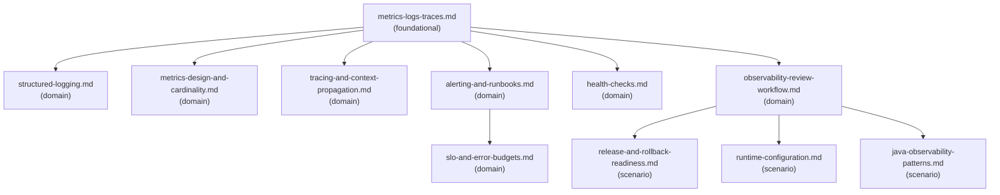

# Reference Index: backend-observability-and-operations

This index maps all reference files for this skill, their tiers, purposes, and
relationships. Use it to navigate the reference graph and determine load order
without loading all files.

## Reference Graph

## Reference Table

| File | Tier | Purpose | Load when | See also |
|------|------|---------|-----------|----------|
| `metrics-logs-traces.md` | foundational | Three signal types (metrics/logs/traces) and 4 operator questions | Starting any observability review — load first | structured-logging.md, metrics-design-and-cardinality.md, tracing-and-context-propagation.md, alerting-and-runbooks.md, observability-review-workflow.md |
| `observability-review-workflow.md` | domain | 10-step procedural workflow with skip conditions and quality bar per step | Executing a full observability review or designing for a new backend feature | release-and-rollback-readiness.md, runtime-configuration.md, java-observability-patterns.md |
| `structured-logging.md` | domain | Structured log field design and sensitive-data avoidance rules | Reviewing or planning logging for a backend change | — |
| `metrics-design-and-cardinality.md` | domain | Metric type selection, label/dimension rules, and cardinality risk review | Reviewing or designing metrics for a backend change | — |
| `tracing-and-context-propagation.md` | domain | Trace boundary identification, context propagation rules, and failure modes | Reviewing or designing distributed tracing for a backend change | — |
| `alerting-and-runbooks.md` | domain | Alert quality principles, bad alert anti-patterns, and runbook section guide | Reviewing alerts or drafting runbooks | slo-and-error-budgets.md |
| `health-checks.md` | domain | Liveness/readiness/startup check types, design questions, and failure modes | Change affects health check behavior or traffic routing | — |
| `slo-and-error-budgets.md` | domain | SLI/SLO/error budget concepts and burn-rate alert design patterns | Designing or reviewing alerts; evaluating observability maturity | — |
| `release-and-rollback-readiness.md` | scenario | Backward-compatibility, expand-contract migration, feature flag, and rollback failure modes | Release or rollback concerns are present — canary, migration, compatibility risk | — |
| `runtime-configuration.md` | scenario | Environment config, secrets separation, feature flags, kill switches, and config validation | Change adds or modifies runtime configuration, feature flags, or environment-specific behavior | — |
| `java-observability-patterns.md` | scenario | Java-specific illustrative patterns for structured logging, metrics, and tracing | Working in a Java codebase and need concrete pattern examples | — |

## Tier Convention

| Tier | Definition | Load rule |
|------|------------|-----------|
| **foundational** | No dependencies. Provides vocabulary and signal taxonomy. | Load first — provides the classification framework for all signals. |
| **domain** | Extends foundational for a specific signal type or workflow area. | Load when the task targets that signal or workflow concern. |
| **scenario** | Activated only when a specific condition is detected. | Load only when that condition is observed (release risk, config concern, Java stack). |

## Navigation Rules

`see-also` is a forward navigation pointer ("after reading this file, also consider loading these"). It is not a dependency declaration.

- `foundational` has no upstream dependencies. Its `see-also` entries point forward to `domain` files.
- `domain` has no upstream dependencies on `scenario`. Its `see-also` entries may point to other `domain` or terminal `scenario` files.
- `scenario` files are terminal leaves — `see-also: []`.
- Avoid bidirectional `see-also` between peer files at the same tier.
