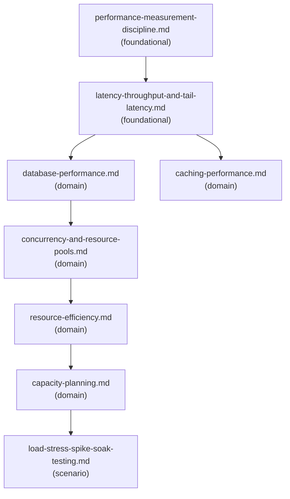

# Reference Index: backend-performance-and-scalability

This index maps all reference files for this skill, their tiers, purposes, and
relationships. Use it to navigate the reference graph and determine load order
without loading all files.

## Reference Graph

## Reference Table

| File | Tier | Purpose | Load when | See also |
|------|------|---------|-----------|----------|
| `performance-measurement-discipline.md` | foundational | Core principle — measure before optimize; measurement sources, workflow, and anti-patterns | Starting any performance analysis — load this first | latency-throughput-and-tail-latency.md |
| `latency-throughput-and-tail-latency.md` | foundational | Core vocabulary — latency, throughput, p95/p99, saturation; failure modes from averaging or ignoring tail | Understanding or explaining core performance metrics; any latency-sensitive feature | database-performance.md, caching-performance.md |
| `database-performance.md` | domain | DB bottleneck analysis — queries, indexes, N+1, pagination, lock contention, connection pools | Task involves database queries, slow queries, missing indexes, N+1, or DB connection limits | concurrency-and-resource-pools.md |
| `caching-performance.md` | domain | Caching performance and correctness — hit rate, invalidation, stampede, stale data, cache failure modes | Task involves caching strategy, cache correctness, low hit rate, or cache outage behavior | — |
| `concurrency-and-resource-pools.md` | domain | Concurrency safety and resource pool sizing — thread pools, connection pools, locks, backpressure, exhaustion | Task involves concurrency, thread contention, connection pool limits, or queue consumer design | resource-efficiency.md |
| `resource-efficiency.md` | domain | Resource efficiency — CPU, memory, IO, network, connection leaks, excessive logging, wasteful patterns | Task involves CPU pressure, memory growth, connection leaks, or IO-bound operations | capacity-planning.md |
| `capacity-planning.md` | domain | Capacity planning — demand inputs, resource model, headroom estimation, saturation signals, scaling triggers | Task involves traffic growth, quota limits, scaling decisions, or peak capacity estimation | load-stress-spike-soak-testing.md |
| `load-stress-spike-soak-testing.md` | scenario | Load test types and design — load, stress, spike, soak; design questions, safety, pass/fail criteria | Load testing is part of the analysis, validation plan, or performance acceptance criteria | — |

## Tier Convention

| Tier | Definition | Load rule |
|------|------------|-----------|
| **foundational** | No dependencies. Core vocabulary and measurement principles. | Load first. Load both foundational files before any domain file. |
| **domain** | Extends foundational for a specific performance area. | Load only when the task targets that area. |
| **scenario** | Activated by a specific condition. | Load only when load testing is part of the workflow. |

## Navigation Rules

`see-also` is a forward navigation pointer ("after reading this file, also consider loading these based on the current task"). It is not a dependency declaration.

- `foundational` has no upstream dependencies. Its `see-also` entries are forward hints pointing to other foundational or domain files.
- `domain` has no upstream dependencies on `scenario`. Its `see-also` entries may point to foundational or other domain files.
- `scenario` is a terminal tier in this skill. `see-also: []` — do not reference other scenario files.
- Avoid bidirectional `see-also` between peer files at the same tier.
