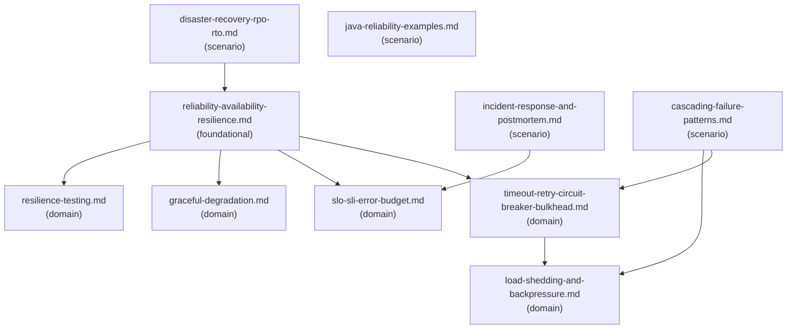

# Reference Index: backend-reliability-and-resilience

This index maps all reference files, their tiers, purposes, and relationships.
Use it to navigate the graph and determine which files to load without reading all of them.

## Reference Graph

## Reference Table

| File | Tier | Purpose | Load when | See also |
| ---- | ---- | ------- | --------- | -------- |
| `reliability-availability-resilience.md` | foundational | Core definitions: reliability, availability, resilience, durability, recoverability | Starting any reliability task — load first | `timeout-retry-circuit-breaker-bulkhead.md`, `slo-sli-error-budget.md`, `graceful-degradation.md`, `resilience-testing.md` |
| `timeout-retry-circuit-breaker-bulkhead.md` | domain | Timeout, retry, circuit breaker, bulkhead; jitter, backoff, deadline propagation, idempotency key | Timeout/retry/circuit-breaker/bulkhead review or design | `load-shedding-and-backpressure.md` |
| `slo-sli-error-budget.md` | domain | SLI criteria, SLO target-setting, error budget, burn-rate alerting | SLO/SLI definition or error budget analysis | (none) |
| `graceful-degradation.md` | domain | Degradation strategies: cache, queue, disable, partial response, fallback provider | Fallback or partial-availability design | (none) |
| `resilience-testing.md` | domain | Test types for failure behavior; safety constraints for destructive tests | Resilience test or chaos engineering design | (none) |
| `load-shedding-and-backpressure.md` | domain | Load shedding strategies and backpressure mechanisms for overload protection | Overload, queue saturation, or traffic spike risk | (none) |
| `disaster-recovery-rpo-rto.md` | scenario | RPO, RTO, MTTR, MTBF; DR planning; backup/restore failure modes; multi-region failover | DR, RPO/RTO, backup restore, or multi-region failover in scope | `reliability-availability-resilience.md` |
| `incident-response-and-postmortem.md` | scenario | Incident readiness, runbook content, postmortem structure | Incident readiness review or runbook creation | `slo-sli-error-budget.md` |
| `cascading-failure-patterns.md` | scenario | Retry storm, thundering herd, head-of-line blocking; propagation mechanics and mitigation | Cascading failure, retry storm, or fan-out amplification risk detected | `timeout-retry-circuit-breaker-bulkhead.md`, `load-shedding-and-backpressure.md` |
| `java-reliability-examples.md` | scenario | Java sketches: dependency policy record, fallback shape — illustrative only | Java code examples explicitly requested | (none) |

## Tier Convention

| Tier | Definition | Load rule |
| ---- | ---------- | --------- |
| **foundational** | Core vocabulary. No upstream dependencies. | Load first when shared vocabulary is needed. |
| **domain** | Specific resilience area. May reference foundational via `see-also`. | Load when the task targets that area. |
| **scenario** | Condition-specific. No upstream dependencies on other scenario files. | Load only when that condition is observed. |

## Navigation Rules

`see-also` is a forward navigation pointer — "after reading this file, also consider loading these."
It is not a dependency declaration.

- `foundational` → no upstream dependencies; `see-also` points forward to `domain`.
- `domain` → no upstream dependencies on `scenario`; `see-also` may point to `foundational` or other `domain`.
- `scenario` → no upstream dependencies on other `scenario`; `see-also` may point to `foundational` or `domain`.
- Avoid bidirectional `see-also` between peer files at the same tier.
