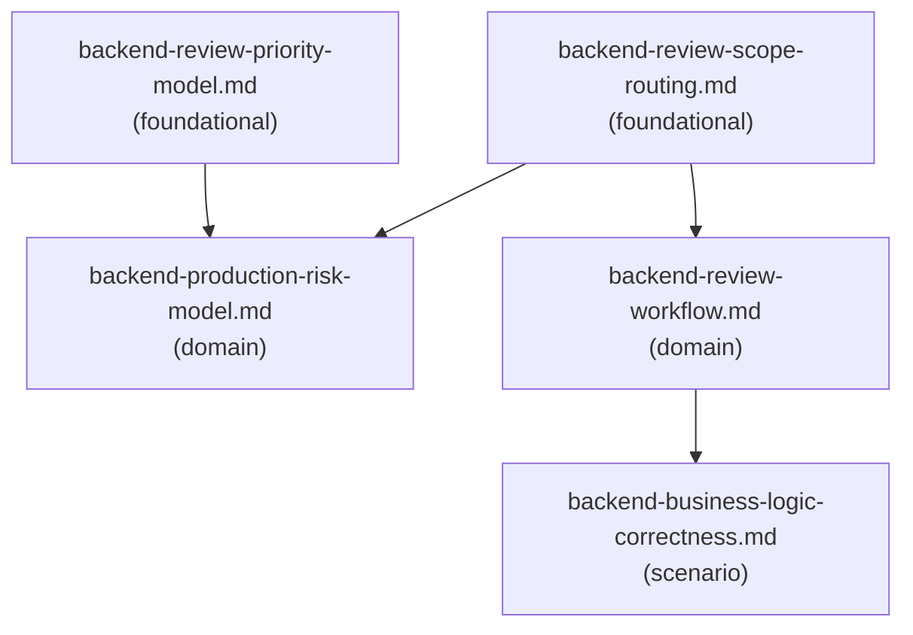

# Reference Index: backend-review-orchestrator

This index maps all reference files, their tiers, purposes, and relationships.
Use it to navigate the graph and determine which files to load without reading all of them.

## Reference Graph

## Reference Table

| File | Tier | Purpose | Load when | See also |
| ---- | ---- | ------- | --------- | -------- |
| `backend-review-scope-routing.md` | foundational | Change signal → scope routing table; multi-scope examples | Classifying which backend scopes are affected | `backend-production-risk-model.md`, `backend-review-workflow.md` |
| `backend-review-priority-model.md` | foundational | Blocking/Important/Optional severity thresholds | Assigning severity to a finding or calibrating overall review risk | `backend-production-risk-model.md` |
| `backend-production-risk-model.md` | domain | High-risk areas and production failure mode table | Prioritizing areas that need deeper scrutiny or human review | (none) |
| `backend-review-workflow.md` | domain | Step-by-step multi-scope review procedure | Executing a structured full review pass | `backend-business-logic-correctness.md` |
| `backend-business-logic-correctness.md` | scenario | Domain/API correctness questions, Java signals, bug patterns | Domain/API scope classified as affected | (none) |

## Tier Convention

| Tier | Definition | Load rule |
| ---- | ---------- | --------- |
| **foundational** | Core vocabulary, routing, and severity model. No upstream dependencies. | Load first when scope classification or severity calibration is needed. |
| **domain** | Specific review procedure or risk model area. May reference foundational via `see-also`. | Load when that specific area is involved in the review. |
| **scenario** | Load only when a specific scope or condition is detected. | Load only when that condition is observed. |

## Navigation Rules

`see-also` is a forward navigation pointer — "after reading this file, also consider loading these."
It is not a dependency declaration.

- `foundational` → no upstream dependencies; `see-also` points forward to `domain` files.
- `domain` → no upstream dependencies on `scenario`; `see-also` may point to `foundational` or other `domain`.
- `scenario` → no upstream dependencies; `see-also: []` for terminal leaves.
- Avoid bidirectional `see-also` between peer files at the same tier.
