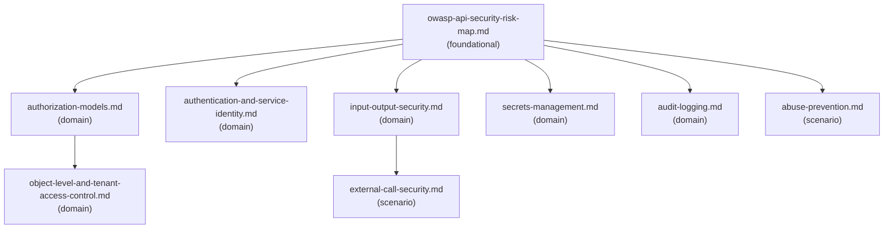

# Reference Index: backend-security-and-trust

This index maps all reference files for this skill, their tiers, purposes, and
relationships. Use it to navigate the reference graph and determine load order
without loading all files.

## Reference Graph

## Reference Table

| File | Tier | Purpose | Load when | See also |
|------|------|---------|-----------|----------|
| `owasp-api-security-risk-map.md` | foundational | OWASP API top-10 risk taxonomy and backend review questions | Starting any security review — load first | authorization-models.md, authentication-and-service-identity.md, input-output-security.md, secrets-management.md, abuse-prevention.md, audit-logging.md |
| `authorization-models.md` | domain | Authorization model selection, decision guide, and common smells | Authorization design, role/permission model, or access control review | object-level-and-tenant-access-control.md |
| `authentication-and-service-identity.md` | domain | Authentication patterns, token validation checklist, service-to-service identity | Authentication, token/session validation, or service-to-service identity | — |
| `input-output-security.md` | domain | Input injection risks and output exposure risks | Input validation, injection risk, or API response exposure review | external-call-security.md |
| `object-level-and-tenant-access-control.md` | domain | Object ownership verification and tenant isolation required checks | Resource ownership, tenant isolation, or multi-tenant data access | — |
| `secrets-management.md` | domain | Secrets handling rules, review questions, and common smells | Credentials, API keys, tokens, certificates, or sensitive config | — |
| `audit-logging.md` | domain | Audit event design, required fields, and what to avoid | Security-relevant logging, accountability, or compliance auditing | — |
| `abuse-prevention.md` | scenario | Abuse controls — rate limiting, quotas, replay protection, cost bounding | Abuse risk detected: public APIs, expensive operations, replay-vulnerable flows | — |
| `external-call-security.md` | scenario | Outbound HTTP security, webhook validation, third-party API trust | Outbound calls, SSRF risk, webhook handlers, or third-party API integration | input-output-security.md |

## Tier Convention

| Tier | Definition | Load rule |
|------|------------|-----------|
| **foundational** | No dependencies. Provides vocabulary and risk taxonomy. | Load first when starting any security review. |
| **domain** | Extends foundational for a specific security area. | Load when the task targets that area. |
| **scenario** | Activated only when a specific condition is detected. | Load only when that trigger condition is observed. |

## Navigation Rules

`see-also` is a forward navigation pointer ("after reading this file, also consider loading these"). It is not a dependency declaration.

- `foundational` has no upstream dependencies. Its `see-also` entries point forward to `domain` files.
- `domain` has no upstream dependencies on `scenario`. Its `see-also` entries may point to `foundational` or other `domain` files.
- `scenario` has no upstream dependencies on other `scenario` files. Its `see-also` entries may point to `foundational` or `domain` files.
- Avoid bidirectional `see-also` between peer files at the same tier.
