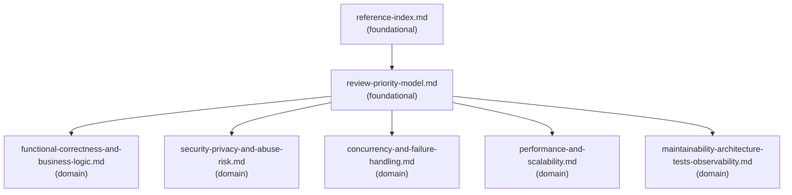

# Reference Index

## Dependency Graph

Solid arrows = load-order guidance. Load the source before the target when the review needs that detail.

## Reference Table

| File | Tier | Purpose | Load when | See also |
| --- | --- | --- | --- | --- |
| `reference-index.md` | foundational | Navigation map for all supporting files in this Skill | Starting a review that may need multiple supporting files, or when unsure which reference to load first | - |
| `review-priority-model.md` | foundational | Severity model and review priority order | Starting any non-trivial code review | `functional-correctness-and-business-logic.md`, `security-privacy-and-abuse-risk.md`, `concurrency-and-failure-handling.md`, `performance-and-scalability.md`, `maintainability-architecture-tests-observability.md` |
| `functional-correctness-and-business-logic.md` | domain | Correctness, domain rule, state, contract, and data consistency checks | Reviewing behavior, business logic, API contracts, state transitions, or data writes | - |
| `security-privacy-and-abuse-risk.md` | domain | Security, privacy, abuse, and reliability checks | Reviewing auth, permissions, input/output safety, secrets, privacy, abuse, or reliability-sensitive changes | - |
| `concurrency-and-failure-handling.md` | domain | Concurrency, retries, timeouts, partial failure, and resource lifecycle checks | Reviewing async work, distributed flows, retries, transactions, resource handling, or failure modes | - |
| `performance-and-scalability.md` | domain | Performance, scalability, data access, CPU/memory, I/O, and network checks | Reviewing hot paths, queries, limits, batching, resource usage, or expected load | - |
| `maintainability-architecture-tests-observability.md` | domain | Maintainability, architecture, tests, and observability checks | Reviewing structure, boundaries, test coverage, diagnostics, logs, metrics, or traces | - |

## Checklist Navigation

| File | Purpose | Load when |
| --- | --- | --- |
| `checklists/pr-review-checklist.md` | Checklist for full PR or diff review | Reviewing a complete PR, broad diff, or merge readiness |
| `checklists/ai-generated-code-review-checklist.md` | Checklist for AI-generated or generated code risks | Reviewing generated code, AI-created patches, or suspiciously plausible code |

## Template and Example Navigation

| File | Purpose | Load when |
| --- | --- | --- |
| `templates/severity-review-report.md` | Full severity-based review report template | Producing a complete review report |
| `templates/diff-review-summary.md` | Condensed diff review summary template | Producing a compact summary of a diff or PR |
| `templates/minimal-fix-plan.md` | Minimal fix plan template for a finding | User asks for a fix plan after findings are identified |
| `examples/severity-based-review-example.md` | Example severity-based review output | Calibrating output depth or severity wording |

## Navigation Rules

- Load `reference-index.md` first when review scope is broad or multiple references may apply.
- Load `review-priority-model.md` for any non-trivial review before selecting domain references.
- Load only domain references that match the changed code or risk area.
- Load checklists when reviewing completeness, merge readiness, or generated code risks.
- Load templates only when producing the corresponding output.
- Load the example only for output calibration.
