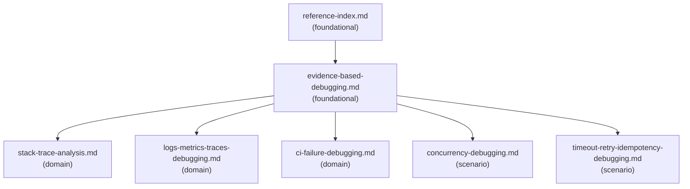

# Reference Index

## Dependency Graph

Solid arrows = load-order guidance. Load the source before the target when the debugging task needs that detail.

## Reference Table

| File | Tier | Purpose | Load when | See also |
| --- | --- | --- | --- | --- |
| `reference-index.md` | foundational | Navigation map for all supporting files in this Skill | Starting a debugging task that may need multiple supporting files, or when unsure which reference to load first | - |
| `evidence-based-debugging.md` | foundational | Core evidence, hypothesis, experiment, root-cause, minimal-fix, regression-test, and validation workflow | Starting any non-trivial debugging task | `stack-trace-analysis.md`, `logs-metrics-traces-debugging.md`, `ci-failure-debugging.md`, `concurrency-debugging.md`, `timeout-retry-idempotency-debugging.md` |
| `stack-trace-analysis.md` | domain | Exception and stack trace analysis patterns | Debugging exceptions, caused-by chains, application frames, or line-number failures | - |
| `logs-metrics-traces-debugging.md` | domain | Logs, metrics, traces, correlation, and observability gaps | Debugging runtime symptoms, production symptoms, operational signals, or observability data | - |
| `ci-failure-debugging.md` | domain | CI job, build, test, cache, dependency, and environment failure analysis | Debugging CI job failures, pipeline failures, build failures, or failing CI commands | - |
| `concurrency-debugging.md` | scenario | Race condition, deadlock, duplicate write, lost update, and order-dependent failure analysis | Debugging flaky behavior, races, deadlocks, duplicate records, inconsistent state, or order-dependent failures | - |
| `timeout-retry-idempotency-debugging.md` | scenario | Timeout, retry, retry storm, duplicate side effect, and idempotency analysis | Debugging hangs, timeouts, retries, duplicate side effects, retry storms, or idempotency gaps | - |

## Checklist Navigation

| File | Purpose | Load when |
| --- | --- | --- |
| `checklists/debugging-checklist.md` | End-to-end debugging completeness check | Before summarizing findings, when the task is broad, or when audit completeness matters |
| `checklists/before-fix-checklist.md` | Pre-edit root-cause, scope, safety, and validation gate | Before editing code for a bug fix |

## Template Navigation

| File | Purpose | Load when |
| --- | --- | --- |
| `templates/debug-report.md` | Full debugging analysis report | Producing a complete diagnostic report |
| `templates/hypothesis-table.md` | Ranked hypothesis table | Comparing plausible causes or planning experiments |
| `templates/reproduction-steps.md` | Reproducibility capture | Documenting how to reproduce a failure |
| `templates/root-cause-analysis.md` | Incident or failure root-cause analysis | Producing an RCA for a confirmed incident or failure |
| `templates/regression-test-after-fix.md` | Regression test plan after a fix direction | Describing the test that should fail before the fix and pass after it |

## Navigation Rules

- Load `reference-index.md` first when multiple references may apply.
- Load `evidence-based-debugging.md` for any non-trivial debugging task.
- Load only domain or scenario references that match the observed failure.
- Load checklists before fixing or before summarizing broad debugging work.
- Load templates only when producing the corresponding artifact.
