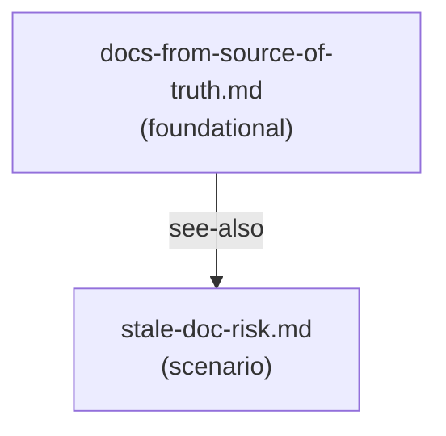

# Reference Index: documentation-and-knowledge-management

This index maps all reference files for this skill, their tiers, purposes, and
relationships. Use it to navigate the reference graph and determine load order
without loading all files.

## Reference Graph

## Reference Table

| File | Tier | Purpose | Load when | See also |
|------|------|---------|-----------|----------|
| `docs-from-source-of-truth.md` | foundational | Source priority order and verification discipline for grounding documentation claims in code, tests, configs, and APIs | Writing or reviewing any documentation where factual accuracy matters | stale-doc-risk.md |
| `stale-doc-risk.md` | scenario | High-risk stale claim categories and staleness signals for detecting documentation drift | Reviewing existing documentation for currency, or when the doc was written before recent code changes | docs-from-source-of-truth.md |

## Tier Convention

| Tier | Definition | Load rule |
|------|------------|-----------|
| **foundational** | No dependencies. Provides vocabulary and core principles. | Load first when source grounding or evidence discipline is needed. |
| **scenario** | Activated only when a specific condition is detected. May reference foundational. | Load only when reviewing existing docs for staleness. |

## Navigation Rules

`see-also` is a forward navigation pointer ("after reading this file, also consider loading these"). It is not a dependency declaration.

- `foundational` has no upstream dependencies. Its `see-also` entries are forward hints pointing to `scenario` files.
- `scenario` has no upstream dependencies on other `scenario` files. Its `see-also` entries may point to `foundational`.
- Avoid bidirectional `see-also` between peer files at the same tier.
