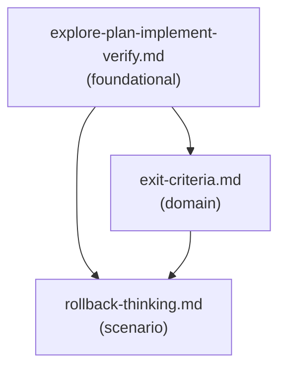

# Reference Index: implementation-planning-and-execution

Maps all reference files, their tiers, purposes, and relationships. Use this to navigate the reference graph and determine load order without loading all files.

## Reference Graph

## Reference Table

| File | Tier | Purpose | Load when | See also |
|------|------|---------|-----------|----------|
| `explore-plan-implement-verify.md` | foundational | 7-step workflow with task risk tier classification | Starting any implementation task or clarifying workflow steps | exit-criteria.md, rollback-thinking.md |
| `exit-criteria.md` | domain | Readiness gates: functional, quality, validation, docs, observability, security | Deciding whether a completed implementation is ready for final summary | explore-plan-implement-verify.md |
| `rollback-thinking.md` | scenario | Code/data/config/deployment rollback analysis proportional to risk | Implementation involves migrations, schema/data changes, config changes, or deployment-sensitive code | exit-criteria.md |

## Tier Convention

| Tier | Definition | Load rule |
|------|------------|-----------|
| foundational | No dependencies. Core workflow vocabulary. | Load first when general workflow guidance is needed. |
| domain | Extends foundational for a specific phase. | Load when deciding readiness of completed work. |
| scenario | Activated only by a specific risk condition. | Load only when high-risk change is detected. |

## Navigation Rules

`see-also` is a forward navigation pointer — "after reading this file, also consider loading these." It is not a dependency declaration.

- `foundational` has no upstream dependencies. Its `see-also` entries point forward to `domain` and `scenario` files.
- `domain` has no upstream dependencies on `scenario`. Its `see-also` entries may point to `foundational`.
- `scenario` has no upstream dependencies on other `scenario` files. Its `see-also` entries may point to `domain`.
