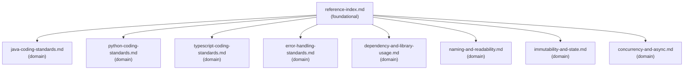

# Reference Index

## Dependency Graph

Solid arrows = load-order guidance. Load this index first when multiple references may apply, then load only the language or cross-cutting references needed for the task.

## Reference Table

| File | Tier | Purpose | Load when | See also |
| --- | --- | --- | --- | --- |
| `reference-index.md` | foundational | Navigation map for all supporting files in this Skill | Starting a broad language-standards task, or when unsure which supporting file to load first | - |
| `java-coding-standards.md` | domain | Java language-level coding standards for type-safe, maintainable implementation and review | Working in Java code or reviewing Java-specific language, structure, runtime, or maintainability choices | `error-handling-standards.md`, `dependency-and-library-usage.md`, `naming-and-readability.md`, `immutability-and-state.md`, `concurrency-and-async.md` |
| `python-coding-standards.md` | domain | Python language-level coding standards for typed, testable, explicit implementation and review | Working in Python code or reviewing Python-specific typing, data model, async, dependency, or maintainability choices | `error-handling-standards.md`, `dependency-and-library-usage.md`, `naming-and-readability.md`, `immutability-and-state.md`, `concurrency-and-async.md` |
| `typescript-coding-standards.md` | domain | TypeScript standards for strict typing, runtime boundaries, modules, async behavior, and frontend-aware code | Working in TypeScript code or reviewing TypeScript-specific typing, runtime validation, module, async, or frontend code-level choices | `error-handling-standards.md`, `dependency-and-library-usage.md`, `naming-and-readability.md`, `immutability-and-state.md`, `concurrency-and-async.md` |
| `error-handling-standards.md` | domain | Cross-language error categories, boundary mapping, retry classification, and safe logging | Error handling, exception mapping, retry behavior, boundary translation, or failure output is central | - |
| `dependency-and-library-usage.md` | domain | Cross-language dependency approval, library selection, version discipline, and security review | Adding, replacing, upgrading, or justifying a dependency or library choice | - |
| `naming-and-readability.md` | domain | Cross-language naming, function shape, comments, and local clarity | Improving or reviewing naming, readability, comments, method/function shape, or local structure | - |
| `immutability-and-state.md` | domain | Cross-language ownership, lifecycle, value objects, and mutable-state risk | Data ownership, mutable state, lifecycle, value objects, DTOs, shared data, or concurrency risk matters | - |
| `concurrency-and-async.md` | domain | Cross-language shared state, timeouts, retries, cancellation, and resource lifecycle | Async work, concurrency, shared state, retries, cancellation, partial failure, or resource lifecycle is involved | - |

## Checklist Navigation

| File | Purpose | Load when |
| --- | --- | --- |
| `checklists/java-implementation-checklist.md` | Java implementation completeness checklist | Reviewing Java implementation completeness |
| `checklists/python-implementation-checklist.md` | Python implementation completeness checklist | Reviewing Python implementation completeness |
| `checklists/typescript-implementation-checklist.md` | TypeScript implementation completeness checklist | Reviewing TypeScript implementation completeness |

## Template Navigation

| File | Purpose | Load when |
| --- | --- | --- |
| `templates/implementation-guidance.md` | Structured implementation guidance output | Producing implementation guidance |
| `templates/language-specific-review.md` | Structured language-specific review output | Producing a code-level review report |
| `templates/coding-standard-fix-plan.md` | Structured coding-standard fix plan output | Producing an ordered minimal fix plan |

## Example Navigation

| File | Purpose | Load when |
| --- | --- | --- |
| `examples/java-service-method-example.md` | Illustrative Java service method example | Calibrating Java guidance or examples |
| `examples/python-service-function-example.md` | Illustrative Python service function example | Calibrating Python guidance or examples |
| `examples/typescript-module-example.md` | Illustrative TypeScript module example | Calibrating TypeScript guidance or examples |

## Navigation Rules

- Load `reference-index.md` first when the task is broad or multiple references may apply.
- Load one language reference for the primary language before cross-cutting references.
- Load cross-cutting references only when the task touches that concern.
- Load checklists when reviewing implementation completeness.
- Load templates only when producing the corresponding output.
- Load examples only for output calibration or illustrative snippets.
