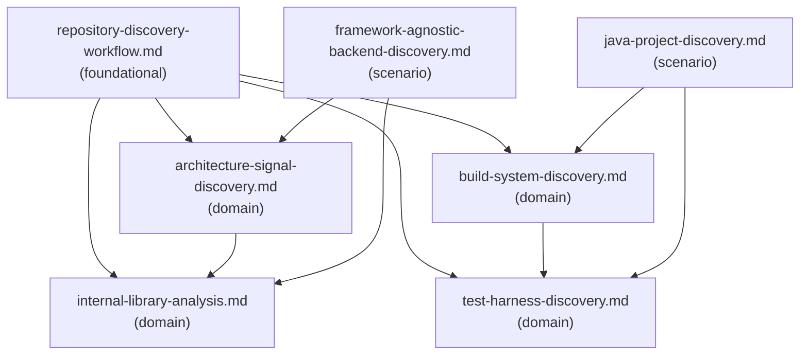

# Reference Index: project-onboarding-and-repo-discovery

Navigates all reference files for this skill. Load this file first to avoid loading all references blindly.

## Reference Graph

## Reference Table

| File | Tier | Purpose | Load when | See also |
|------|------|---------|-----------|----------|
| `repository-discovery-workflow.md` | foundational | 8-phase discovery workflow | Starting any onboarding session | architecture-signal-discovery.md, build-system-discovery.md, internal-library-analysis.md, test-harness-discovery.md |
| `architecture-signal-discovery.md` | domain | Signals for inferring module structure, dependency flow, runtime/integration model | Analyzing architecture without framework assumptions | internal-library-analysis.md |
| `build-system-discovery.md` | domain | Build system signals, command classification (confirmed/candidate/unsafe/unknown) | Identifying build system or classifying commands | test-harness-discovery.md |
| `internal-library-analysis.md` | domain | Analyzing internal libraries — usage clustering, behavior inference, risk escalation | Internal packages, annotations, or custom wrappers detected | — |
| `test-harness-discovery.md` | domain | Test framework, test type, test command, and fixture discovery | Identifying test harness or recommending test strategy | — |
| `framework-agnostic-backend-discovery.md` | scenario | Backend areas: API surface, bootstrap, domain logic, data layer, integration, observability | Backend service signals detected (HTTP, RPC, workers, DB, messaging) | architecture-signal-discovery.md, internal-library-analysis.md |
| `java-project-discovery.md` | scenario | Java-specific build signals, entrypoints, internal patterns, risk areas | Java files or Java build files detected | build-system-discovery.md, test-harness-discovery.md |

## Tier Convention

| Tier | Definition | Load rule |
|------|------------|-----------|
| **foundational** | No dependencies. Core vocabulary and workflow. | Load first when the full workflow or classification is needed. |
| **domain** | Extends foundational for a specific discovery area. | Load only when the task targets that area. |
| **scenario** | Activated only for a specific stack or condition. | Load only when that condition is detected. |

## Navigation Rules

`see-also` is a forward navigation pointer — "after reading this file, also consider loading these."

- `foundational` has no upstream dependencies; `see-also` points forward to `domain`.
- `domain` has no upstream dependencies on `scenario`; `see-also` points to `foundational` or other `domain`.
- `scenario` has no upstream dependencies on other `scenario`; `see-also` points to `foundational` or `domain`.
- Avoid bidirectional `see-also` between peer files at the same tier.
