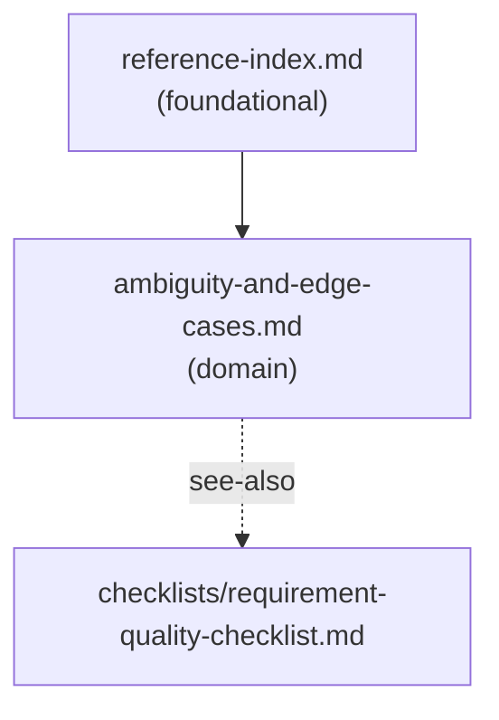

# Reference Index

## Dependency Graph

Solid arrows = load-order dependency (load source before target).
Dashed arrows = `see-also` forward navigation hint (not a hard dependency).

## Reference Table

| File | Tier | Purpose | Load when | See also |
|------|------|---------|-----------|----------|
| `reference-index.md` | foundational | Navigation map — tiers, load order, and see-also edges for all references in this skill | First, when multiple references may be needed or task scope is unclear | — |
| `ambiguity-and-edge-cases.md` | domain | Common ambiguity patterns (vague verbs, unclear actors) and edge case categories (input, data, permissions, concurrency, integration, operations) | Decomposing vague requirements or identifying missing edge cases | `checklists/requirement-quality-checklist.md` |

## Navigation Rules

- Load `reference-index.md` first when the task scope is unclear or multiple references may be needed.
- Load `ambiguity-and-edge-cases.md` when the input is vague, incomplete, or contains unclear terms — always load this in step 2 of the workflow.
- Load `checklists/requirement-quality-checklist.md` when reviewing or finalizing a set of requirements before implementation planning begins.
- There are no scenario-tier references in this skill. Add them when a specific decision point (security-sensitive requirements, data migration risk, multi-tenant access, compliance constraints) justifies targeted context.

## Checklist Navigation

| File | Purpose | Load when |
|------|---------|-----------|
| `checklists/requirement-quality-checklist.md` | Quality bar checklist for reviewing requirements — clarity, testability, completeness, consistency, feasibility, risk | Reviewing or finalizing a set of requirements before implementation planning |

## Template and Example Navigation

Templates and examples are loaded by task context.

| File | Purpose | Load when |
|------|---------|-----------|
| `templates/clarification-questions.md` | Structured clarification output and question banks | Clarification mode or pre-analysis question gathering |
| `templates/feature-brief.md` | Full feature spec template | Producing a complete structured feature document |
| `templates/acceptance-criteria.md` | Given/When/Then and rule-based criteria template | Defining or reviewing acceptance criteria |
| `templates/estimation-breakdown.md` | Work breakdown with confidence and risk drivers | Estimation mode or producing an effort breakdown |
| `examples/vague-po-request-to-feature-spec.md` | Worked example — vague PO request to full feature spec | Reference for complete output format or output depth calibration |
