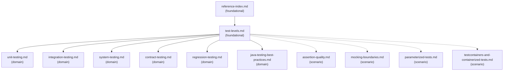

# Reference Index

This index maps supporting files for the `testing-and-validation` Skill so agents can load only the context needed for a task.

## Dependency Graph

Solid arrows = load-order guidance. Load the source before the target when that detail is needed.

Dashed arrows = conditional scenario guidance. Load these files only when the task raises that decision point.

## Reference Table

| File | Tier | Purpose | Load when | See also |
| --- | --- | --- | --- | --- |
| `reference-index.md` | foundational | Navigation map for this Skill's supporting files | Starting broad validation/testing work or when unsure which supporting file to load | - |
| `test-levels.md` | foundational | Test level taxonomy and selection rule | Deciding which test level can prove the behavior | `unit-testing.md`, `integration-testing.md`, `system-testing.md`, `contract-testing.md`, `regression-testing.md`, `java-testing-best-practices.md` |
| `unit-testing.md` | domain | Unit test use cases, traits, structure, and Java notes | Designing or reviewing focused logic tests | - |
| `integration-testing.md` | domain | Integration test targets, database/API checks, and anti-patterns | Testing framework, database, serialization, controller, messaging, cache, or security-filter behavior | - |
| `system-testing.md` | domain | System test use cases, traits, validation targets, and anti-patterns | Validating critical user flows, cross-service workflows, release checks, or incident regressions | - |
| `contract-testing.md` | domain | API/event contract validation and provider/consumer concerns | Checking REST, GraphQL, gRPC, event schema, SDK, or compatibility behavior | - |
| `regression-testing.md` | domain | Regression test purpose, triggers, quality bar, and output expectations | Fixing a bug, incident, escaped defect, or recurring edge case | - |
| `java-testing-best-practices.md` | domain | Java and Spring/backend testing guidance | Working in Java, Spring, transaction, security, or backend test contexts | - |
| `assertion-quality.md` | scenario | Strong vs weak assertions and diagnosable failure guidance | Reviewing assertion strength or improving brittle/low-signal tests | - |
| `mocking-boundaries.md` | scenario | Mock/fake/container boundary guidance | Choosing whether to mock, fake, or use a real/containerized dependency | - |
| `parameterized-tests.md` | scenario | Parameterized test candidates and readability guidance | Many inputs should satisfy the same behavior or validation rule | - |
| `testcontainers-and-containerized-tests.md` | scenario | Containerized test fit, risks, and review questions | Real dependency behavior matters, such as SQL dialects, brokers, caches, or protocol emulators | - |

## Checklist Navigation

| File | Purpose | Load when |
| --- | --- | --- |
| `checklists/before-test-implementation-checklist.md` | Pre-test design checklist | Before generating or editing tests |
| `checklists/generated-test-review-checklist.md` | Generated test quality checklist | Reviewing generated tests or AI-created test changes |

## Template Navigation

| File | Purpose | Load when |
| --- | --- | --- |
| `templates/test-case-matrix.md` | Test matrix output template | Producing a test-case matrix |
| `templates/validation-plan.md` | Validation plan template | Planning checks for a change |
| `templates/regression-test-plan.md` | Regression test plan template | Planning a bug or incident regression test |
| `templates/test-execution-report.md` | Test execution report template | Summarizing commands run, failures, and residual risks |

## Navigation Rules

- Load `reference-index.md` first when the testing scope is broad or multiple references may apply.
- Load `test-levels.md` before selecting a test-specific reference.
- Load only the domain references that match the chosen test level or stack.
- Load scenario references only for assertion quality, mock/fake/container boundaries, parameterized cases, or real dependency behavior.
- Load checklists when preparing or reviewing tests.
- Load templates only when producing the corresponding artifact.
